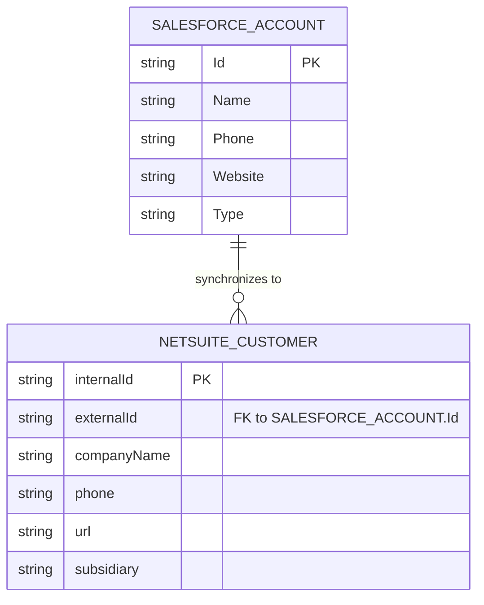

# Data Model Specification
# Portfolio Project: [Project Name]

---

## Document Information
**Version:** 1.0  
**Date:** [YYYY-MM-DD]  
**Author:** [Your Name]  
**Status:** [Draft / In Review / Approved]

---

## 1. Introduction

### 1.1. Purpose
This document provides a detailed description of the data structures and relationships for the "[Project Name]" project. It serves as a blueprint for understanding how data is organized, stored, and transformed between the systems involved in this integration.

### 1.2. Scope
The scope of this document covers the data models for the key entities being synchronized, including their attributes, data types, and the explicit mappings between the source and destination systems.

### 1.3. References
| ID | Document/Link | Description |
|----|---|---|
| 1  | `FSD.md` | The Functional Specification Document, which outlines the data requirements from a business perspective. |
| 2  | `TSD.md` | The Technical Specification Document, which details how this data model will be implemented. |

---

## 2. Conceptual Data Model

### 2.1. Overview
The conceptual model for this integration focuses on two primary entities: the **Account** from the source system (e.g., Salesforce) and the **Customer** from the destination system (e.g., NetSuite). The core relationship is a one-to-one link between a source Account and a destination Customer, ensuring data consistency.

### 2.2. Entity-Relationship Diagram (ERD)
*(A diagram would typically be embedded here or linked to from the `05_design` folder.)*

### 2.3. Entity Descriptions
*   **Salesforce Account:** Represents a business or organization that is a potential or existing customer. It is the source of truth for basic company information.
*   **NetSuite Customer:** Represents the financial record for a customer in the ERP system. It is created and updated based on the data from the Salesforce Account.

---

## 3. Logical Data Model

This section provides more detail on the attributes of each key entity.

### 3.1. Salesforce Account Entity
| Attribute | Data Type | Nullable? | Description |
| :--- | :--- | :--- | :--- |
| `Id` | `string(18)` | No | Unique identifier for the account in Salesforce. **(Primary Key)** |
| `Name` | `string(255)` | No | The legal name of the company. |
| `Phone` | `string(40)` | Yes | Primary phone number for the company. |
| `Website` | `url` | Yes | The company's official website. |
| `Type` | `picklist` | Yes | The category of the account (e.g., 'Customer - Direct', 'Prospect'). |

### 3.2. NetSuite Customer Entity
| Attribute | Data Type | Nullable? | Description |
| :--- | :--- | :--- | :--- |
| `internalId` | `integer` | No | Auto-generated unique identifier in NetSuite. **(Primary Key)** |
| `externalId` | `string(255)` | No | Stores the Salesforce `Id` to link the two records. **(Foreign Key)** |
| `companyName` | `string(83)` | No | The name of the customer company. |
| `phone` | `string(32)` | Yes | The customer's primary phone number. |
| `url` | `string(999)` | Yes | The customer's website URL. |
| `subsidiary` | `reference` | No | The NetSuite subsidiary the customer belongs to. |

---

## 4. Physical Data Model & Field Mappings

This section defines the precise transformations and rules for moving data between the source and destination systems. This is the primary specification for the integration's transformation logic.

| Source System | Source Field | Source Type | Destination System | Destination Field | Destination Type | Required? | Transformation Rules & Logic |
| :--- | :--- | :--- | :--- | :--- | :--- | :--- | :--- |
| Salesforce | `Id` | `string(18)` | NetSuite | `externalId` | `string(255)` | Yes | Direct 1:1 mapping. This is the key for all updates. |
| Salesforce | `Name` | `string(255)` | NetSuite | `companyName` | `string(83)` | Yes | Direct 1:1 mapping. **Note:** Truncate source string to 83 characters if it is longer. |
| Salesforce | `Phone` | `string(40)` | NetSuite | `phone` | `string(32)` | No | Direct 1:1 mapping. **Note:** Strip non-numeric characters and truncate to 32 characters if necessary. |
| Salesforce | `Website` | `url` | NetSuite | `url` | `string(999)` | No | Direct 1:1 mapping. |
| Salesforce | `Type` | `picklist` | (Logic) | (Condition) | `N/A` | `N/A` | **Filter Condition:** Only process records where `Type` is equal to 'Customer - Direct'. This field is not mapped directly. |
| `(Constant)` | `N/A` | `N/A` | NetSuite | `subsidiary` | `reference` | Yes | **Hardcoded Value:** Set the internal ID of the target subsidiary (e.g., '1' for "USA"). This value must be configurable. |

---

## 5. Data States

The integration service needs to be aware of the state of the data it is processing.

| State | Description |
| :--- | :--- |
| **New** | A record has been created in the source system but has not yet been processed by the integration. |
| **Synchronized** | The record has been successfully created/updated in the destination system. |
| **Error** | An attempt to synchronize the record failed. The record should be flagged for review or retry. |
| **Ignored** | The record does not meet the criteria for synchronization (e.g., wrong `Type`). |

---

## 6. Revision History
| Version | Date | Author | Changes |
| :--- | :--- | :--- | :--- |
| 1.0 | [YYYY-MM-DD] | [Your Name] | Initial draft. |