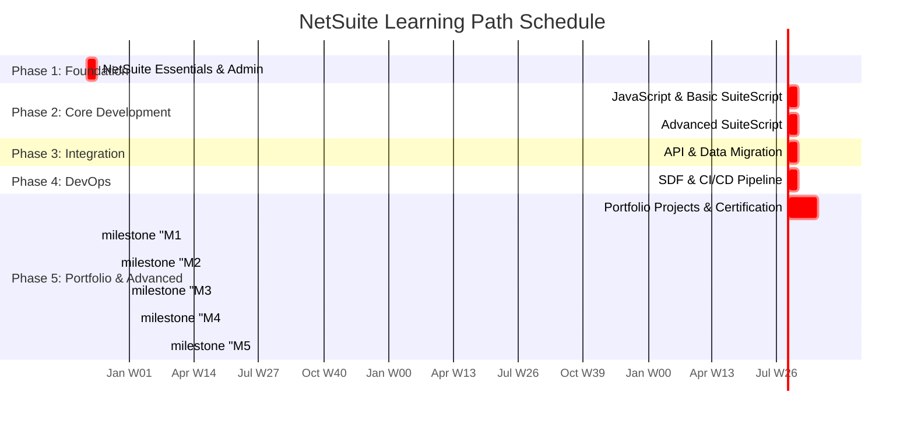

# Project Schedule
# Project: NetSuite Learning Path

---

## Document Information
**Version:** 1.0  
**Date:** [YYYY-MM-DD]  
**Author:** [Your Name]  
**Status:** [Draft / In Review / Approved]

---

## 1. Introduction

### 1.1. Purpose
This document provides the detailed project schedule for the "NetSuite Learning Path" project. It breaks down the work packages from the Work Breakdown Structure (WBS) into a timeline, assigning tasks to specific weeks. This schedule serves as the primary tool for tracking progress and managing time throughout the project.

### 1.2. References
| ID | Document/Link | Description |
|----|---|---|
| 1  | `roadmap.md` | The high-level project roadmap. |
| 2  | `estimates.md` | The detailed effort estimations for each task. |
| 3  | `WBS.md` | The detailed breakdown of all work packages. |

---

## 2. High-Level Schedule (Gantt Chart)

This Gantt chart provides a visual overview of the project's major phases and key milestones over a 16-week timeline.

---

## 3. Detailed Weekly Schedule

### Month 1: Foundation & Core Development Kickstart

| Week | Dates | WBS Ref | Key Tasks | Weekly Goal | Deliverable(s) | Status |
| :--- | :--- | :--- | :--- | :--- | :--- | :--- |
| **1** | [Dates] | 1.1.1, 1.1.2 | - Complete "NetSuite Essentials" course. - Practice creating custom fields and forms. | Understand core NetSuite navigation and declarative customization. | Notes on Order-to-Cash; A customized Sales Order form. | Not Started |
| **2** | [Dates] | 1.1.3, 1.1.4 | - Build a simple SuiteFlow workflow. - Study for and take `SuiteFoundation` exam. | Achieve `SuiteFoundation` certification. | A functional approval workflow; Certification result. | Not Started |
| **3** | [Dates] | 1.2.1, 1.2.2 | - Complete JavaScript (ES6+) refresher. - Set up VS Code for SuiteScript development. | Establish a solid JS foundation and a working development environment. | VS Code configured with SDF extension. | Not Started |
| **4** | [Dates] | 1.2.3 | - Write and deploy a User Event script (e.g., data validation). - Write and deploy a Client script (e.g., field validation). | Successfully deploy two types of SuiteScripts to a sandbox. | Two functional SuiteScript files in the Git repo. | Not Started |

### Month 2: Deep Dive into Development & Integration

| Week | Dates | WBS Ref | Key Tasks | Weekly Goal | Deliverable(s) | Status |
| :--- | :--- | :--- | :--- | :--- | :--- | :--- |
| **5** | [Dates] | 1.2.3, 1.2.4 | - Develop a Scheduled script for a nightly task. - Deep dive into the `N/record` module. | Automate a business process with a scheduled script. | A functional Scheduled Script. | Not Started |
| **6** | [Dates] | 1.2.3, 1.2.4 | - Develop a Map/Reduce script for a bulk update. - Deep dive into the `N/search` module. | Understand and implement a large-scale data processing script. | A functional Map/Reduce script. | Not Started |
| **7** | [Dates] | 1.3.1, 1.3.2 | - Configure Postman for NetSuite REST API. - Practice CRUD operations on Customer records. | Gain proficiency with the SuiteTalk REST API. | A Postman collection for the Customer API. | Not Started |
| **8** | [Dates] | 1.3.3 | - Perform a large CSV data import. - Write a Python script to create records via API. | Master both UI-based and programmatic data migration. | A Python script that creates 100+ customers. | Not Started |

### Month 3: DevOps & Advanced Architecture

| Week | Dates | WBS Ref | Key Tasks | Weekly Goal | Deliverable(s) | Status |
| :--- | :--- | :--- | :--- | :--- | :--- | :--- |
| **9** | [Dates] | 1.4.1, 1.4.2 | - Install and configure the SDF CLI. - Structure a NetSuite project in a Git repository. | Manage NetSuite customizations as code. | A local SDF project linked to a Git repository. | Not Started |
| **10** | [Dates] | 1.4.3 | - Create a CI/CD pipeline in GitHub Actions. - Automate the deployment of the SDF project. | Achieve fully automated deployment from Git to sandbox. | A functional `main.yml` workflow file. | Not Started |
| **11**| [Dates] | 1.5.2 | - Design and begin building Portfolio Project 1 (Integration Hub). | Complete the core logic and connectivity for the first portfolio project. | Project 1, Version 1.0. | Not Started |
| **12**| [Dates] | 1.5.2 | - Design and begin building Portfolio Project 2 (Data Migration Framework). | Develop the main transformation and loading engine. | Project 2, Version 1.0. | Not Started |

### Month 4: Portfolio Building & Finalization

| Week | Dates | WBS Ref | Key Tasks | Weekly Goal | Deliverable(s) | Status |
| :--- | :--- | :--- | :--- | :--- | :--- | :--- |
| **13**| [Dates] | 1.5.2 | - Build Portfolio Project 3 (DevOps Toolkit). | Refine and document the CI/CD pipeline. | Project 3, Version 1.0. | Not Started |
| **14**| [Dates] | 1.5.2 | - Build Portfolio Project 4 (Custom Workflow Engine). | Implement the core state machine and custom record structure. | Project 4, Version 1.0. | Not Started |
| **15**| [Dates] | 1.5.2 | - Build Portfolio Project 5 (Real-Time Analytics Engine). | Develop the RESTlet and data extraction logic. | Project 5, Version 1.0. | Not Started |
| **16**| [Dates] | 1.5.3 | - Study for and take `SuiteCloud Developer II` exam. - Finalize all project documentation and portfolio. | Achieve final certification and complete the project. | Certification result; Finalized portfolio. | Not Started |

---

## 4. Schedule Assumptions

*   **Availability:** This schedule is based on a dedicated effort of approximately **20 person-hours per week**. Any significant deviation from this will require the schedule to be re-baselined.
*   **Sandbox Access:** The schedule assumes consistent and reliable access to a NetSuite sandbox/development account.
*   **Learning Curve:** The time allocated for learning new concepts is an estimate and may vary. The contingency buffer in the `estimates.md` is intended to absorb minor variations.
*   **Scope:** The schedule is based on the scope defined in the `scope.md` document. Any changes to the scope will require a formal change request and a schedule update.

---

## 5. Revision History
| Version | Date | Author | Changes |
| :--- | :--- | :--- | :--- |
| 1.0 | [YYYY-MM-DD] | [Your Name] | Initial draft. |