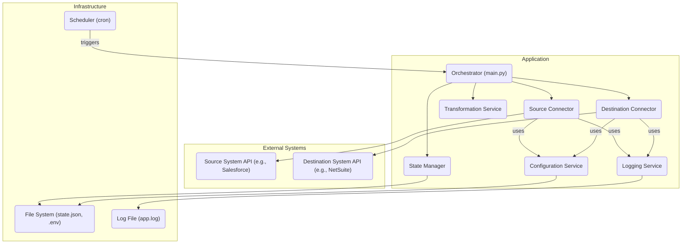

# System Architecture Document
# Portfolio Project: [Project Name]

---

## Document Information
**Version:** 1.0  
**Date:** [YYYY-MM-DD]  
**Author:** [Your Name]  
**Status:** [Draft / In Review / Approved]

---

## 1. Introduction

### 1.1. Purpose
This document provides a comprehensive architectural overview of the "[Project Name]" project. It describes the high-level structure of the system, the relationships and interactions between its major components, and the guiding principles and design decisions that shape the architecture.

### 1.2. Scope
The scope of this document includes the logical, process, and physical deployment views of the system. It defines the technology stack and the key architectural patterns used to meet the project's functional and non-functional requirements.

### 1.3. References
| ID | Document/Link | Description |
|----|---|---|
| 1  | `solution_design.md` | The detailed solution design that this architecture supports. |
| 2  | `NFR.md` | The non-functional requirements that drive many of the architectural decisions. |

---

## 2. Architectural Goals and Constraints

### 2.1. Architectural Drivers (Goals)
The architecture is designed to meet the following key quality attributes:
*   **Maintainability:** The system must be easy to understand, modify, and debug. This is achieved through a modular design with a clear separation of concerns.
*   **Reliability:** The system must be robust and handle errors gracefully. It should not terminate unexpectedly due to single-record processing failures.
*   **Testability:** Individual components must be testable in isolation. The loose coupling between components facilitates effective unit and integration testing.
*   **Simplicity:** The architecture should be as simple as possible while still meeting all requirements. This avoids over-engineering for a project of this scale.
*   **Configurability:** The system must be easily configurable for different environments (e.g., sandbox, production) without code changes.

### 2.2. Constraints
The architecture must operate within the following constraints:
*   **Technology Stack:** The solution will be primarily built using Python 3.
*   **Deployment Environment:** The application is designed to run as a scheduled script (cron job) on a standard Linux or Windows server environment.
*   **Statelessness:** The application itself will be stateless to simplify deployment and execution. All necessary state (e.g., last run time) will be persisted externally.
*   **Project Scope:** This is a single-purpose integration. The architecture is not designed to be a generic, multi-tenant integration platform.

---

## 3. Architectural Style

The chosen architectural style is a **Modular Monolith**.

*   **Description:** The application is deployed as a single process (a monolith), but its internal structure is divided into distinct, loosely-coupled logical modules or components. Each module has a specific responsibility (e.g., connecting to a source, transforming data, logging).
*   **Rationale:** This style provides the deployment simplicity of a traditional monolith while delivering many of the benefits of a more complex architecture like microservices, such as improved maintainability, testability, and code organization. It is the most appropriate choice for a single-purpose, scheduled application, as it avoids the operational overhead and complexity of a distributed system.

---

## 4. System Views

### 4.1. Logical View
This view shows the system's major logical components and their relationships.



*   **Component Responsibilities:**
    *   **Scheduler (cron):** Not part of the application, but triggers its execution.
    *   **Orchestrator:** The main entry point; controls the overall flow.
    *   **Configuration Service:** Loads and provides settings from a `.env` file.
    *   **Connectors (Source/Destination):** Handle all API communication with external systems.
    *   **Transformation Service:** Contains the business logic for mapping data.
    *   **State Manager:** Persists the `last_run_timestamp` to a file.
    *   **Logger:** Manages all application logging.

### 4.2. Process View
This view describes the runtime behavior and interactions between components for a typical run. The process is sequential and synchronous. (For detailed step-by-step interactions, refer to the `sequence_diagrams.md`).

1.  The **Scheduler** invokes the **Orchestrator**.
2.  The **Orchestrator** initializes all services, loading configuration via the **Configuration Service**.
3.  It retrieves the last successful run time from the **State Manager**.
4.  It calls the **Source Connector** with this time to fetch new data from the **Source API**.
5.  For each record returned, it passes the data to the **Transformer**.
6.  The transformed data is then passed to the **Destination Connector**, which loads it into the **Destination API**.
7.  Throughout the process, all components send messages to the **Logger**.
8.  Upon successful completion, the **Orchestrator** updates the run time via the **State Manager**.

### 4.3. Deployment View
This view shows how the application is deployed and run.

```mermaid
graph TD
    subgraph Server (Linux/Windows)
        subgraph Filesystem
            direction LR
            ProjectDir("Project Directory")
            Venv("Python venv")
            DotEnvFile(".env (Credentials)")
            StateFile("state.json")
            LogFile("app.log")
        end
        
        Cron("Cron Job / Task Scheduler")
        Python("Python 3.x Interpreter")
        
        Cron -- "runs every 5 mins" --> Python
        Python -- "executes" --> ProjectDir
        ProjectDir -- "reads/writes" --> DotEnvFile
        ProjectDir -- "reads/writes" --> StateFile
        ProjectDir -- "writes" --> LogFile
    end

    Server -- HTTPS --> Internet
    Internet --> ExternalAPIs("External APIs (NetSuite, Salesforce)")

```
*   **Deployment:** The entire application is deployed as a single directory of Python scripts on a server.
*   **Execution:** A system-level scheduler (cron on Linux, Task Scheduler on Windows) is configured to execute the main Python script at a regular interval (e.g., every 5 minutes).
*   **Dependencies:** The server must have the Python 3 interpreter and all libraries from `requirements.txt` installed, preferably within a virtual environment.

---

## 5. Technology Stack Summary

| Layer | Technology | Rationale |
| :--- | :--- | :--- |
| **Language** | Python 3.9+ | Excellent for scripting, data handling, and API integrations. Extensive library support. |
| **API Interaction** | `requests` library | The de-facto standard for making HTTP requests in Python; simple and powerful. |
| **Authentication** | `requests-oauthlib` | Handles the complexity of OAuth 1.0a (for NetSuite TBA) and OAuth 2.0. |
| **Scheduling** | Cron (or OS equivalent) | OS-native, highly reliable, and decouples scheduling from application logic. |
| **Configuration** | `.env` files | Standard, secure practice for managing environment variables and secrets. |

---

## 6. Revision History
| Version | Date | Author | Changes |
| :--- | :--- | :--- | :--- |
| 1.0 | [YYYY-MM-DD] | [Your Name] | Initial draft of the system architecture. |
