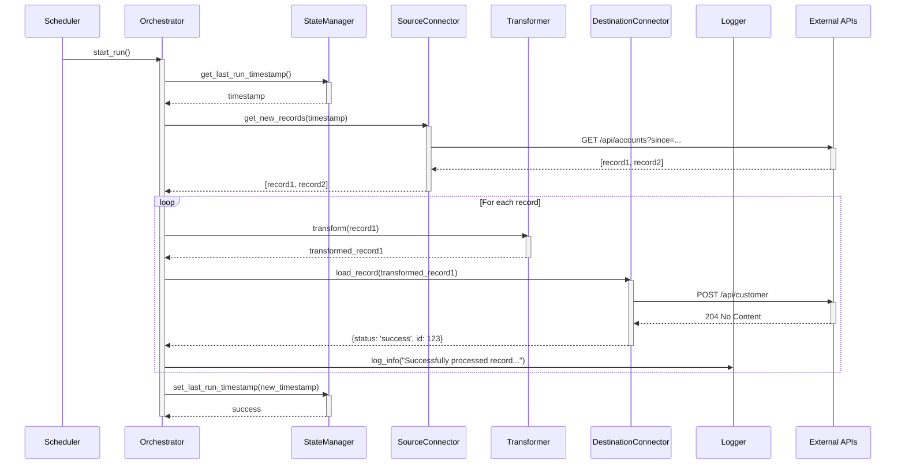
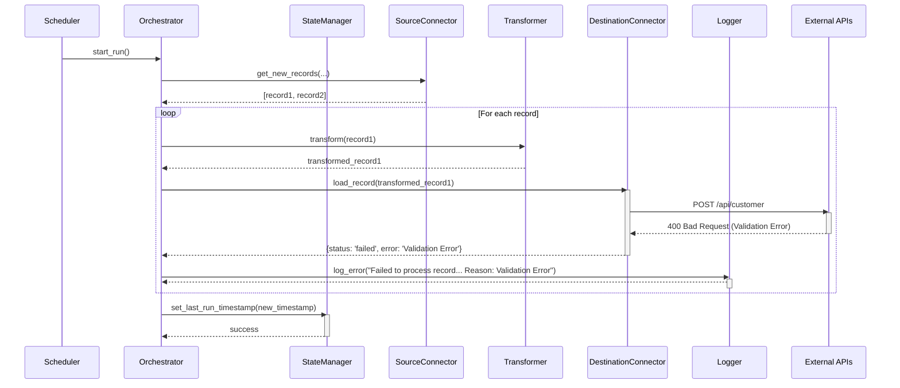

# Sequence Diagrams
# Portfolio Project: [Project Name]

---

## Document Information
**Version:** 1.0  
**Date:** [YYYY-MM-DD]  
**Author:** [Your Name]  
**Status:** [Draft / In Review / Approved]

---

## 1. Introduction

### 1.1. Purpose
This document provides sequence diagrams that illustrate the interactions between the various components of the "[Project Name]" solution. These diagrams visualize how different parts of the system work together to accomplish key tasks, showing the sequence of messages and calls over time.

### 1.2. Scope
The diagrams in this document cover the primary use cases and error-handling scenarios, including successful data synchronization and failures during API communication.

### 1.3. Participants/Actors
The following participants are used in the diagrams:

| Participant | Description |
| :--- | :--- |
| **Scheduler** | An external trigger (e.g., a cron job) that initiates the process. |
| **Orchestrator (`main.py`)** | The main application component that controls the overall workflow. |
| **StateManager** | The component responsible for persisting the application's state (e.g., last run time). |
| **SourceConnector** | The component responsible for fetching data from the source system (e.g., Salesforce). |
| **Transformer** | The component responsible for converting data to the destination format. |
| **DestinationConnector** | The component responsible for loading data into the destination system (e.g., NetSuite). |
| **Logger** | The component responsible for logging messages. |
| **External API** | Represents the API endpoint of an external system (e.g., Salesforce API or NetSuite API). |

---

## 2. Use Case Diagrams

### 2.1. UC-001: Successful Record Synchronization (Happy Path)
This diagram illustrates the sequence of events when a new record is successfully fetched from the source system, transformed, and created in the destination system.

### 2.2. UC-002: Record Synchronization with API Validation Error
This diagram shows the process when the destination system's API rejects a record due to a data validation error. The system logs the error and continues to the next record.

---

## 3. Revision History
| Version | Date | Author | Changes |
| :--- | :--- | :--- | :--- |
| 1.0 | [YYYY-MM-DD] | [Your Name] | Initial draft with diagrams for happy path and error handling. |